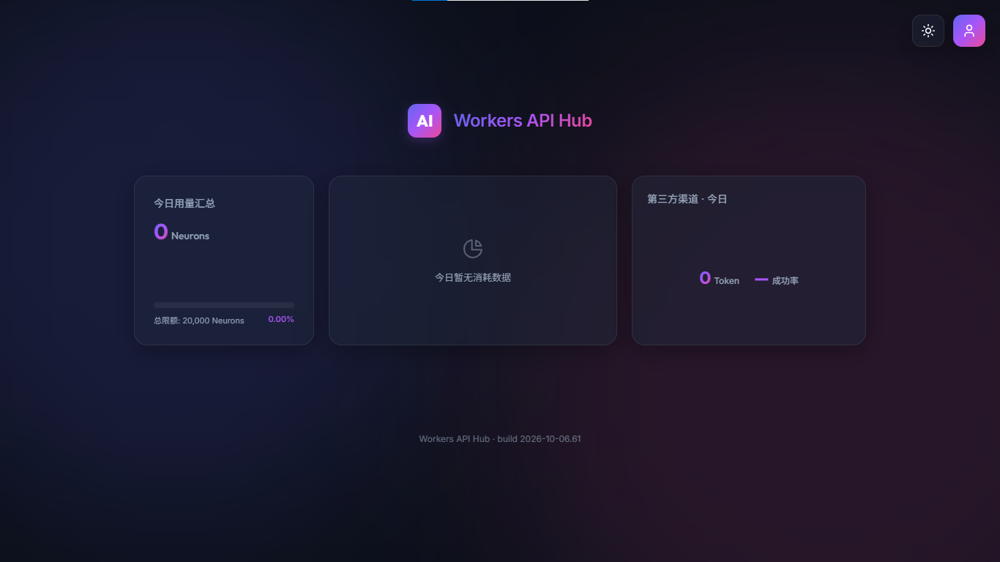
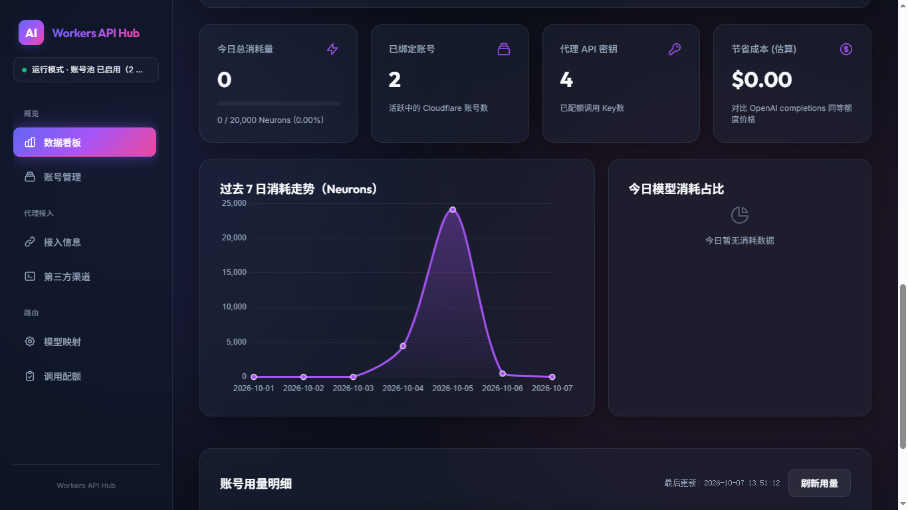
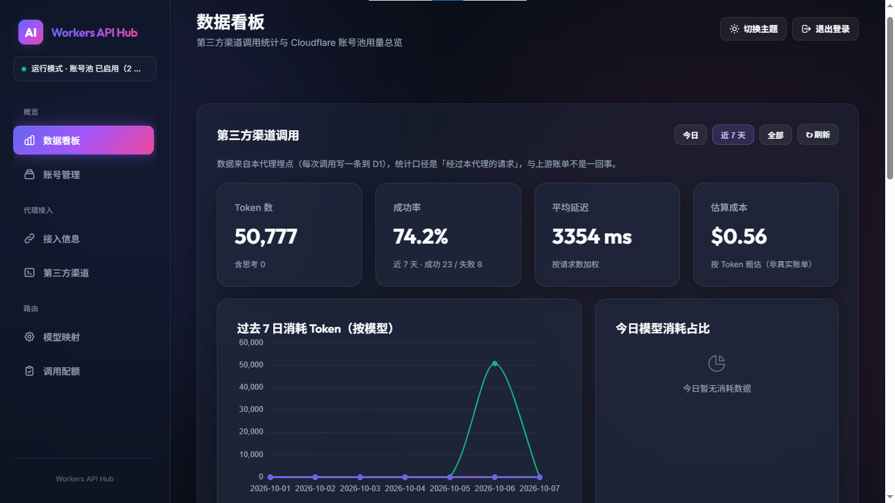

# Workers API Hub

**Workers API Hub** 是跑在 Cloudflare 上的单文件 ES Module：把 Cloudflare Workers AI 账号池与第三方 OpenAI 兼容渠道（OpenRouter、Gemini 免费层等）统一转换成 **OpenAI / Anthropic 双协议**接口。零依赖，前端全内联，部署 = 把 `_worker.js` 上传到 Cloudflare Pages（推荐 `wrangler pages deploy` 或 Git 集成，详见下方「部署」）。核心能力：多上游聚合、配额调度、负载均衡、故障冷却与自动切换、内置管理面板。

> **适用场景**：不想买 VPS / 不想维护服务器，但需要代理海外模型（国内无法直连 OpenRouter / Gemini / OpenAI）。Workers 免费额度够开发用，免运维。国内可直连的上游不建议用——多跳 Cloudflare Edge 徒增延迟。

> 版本号：当前 `BUILD_ID = 2026-10-06.61`，每次改动 +1，部署后 `curl /version` 核对。

## 界面预览

**登录落地页（`/`）**

**管理面板 · 概览（CF 账号池用量总览）**

**管理面板 · 数据看板（第三方渠道调用统计）**

## 功能说明

本网关除基础的反代转发外，还内置了以下完整功能模块：

### 1. 双协议网关
- 把所有上游统一收敛为 **OpenAI 兼容接口**（`/v1/chat/completions`、`/v1/models` 等）。
- 同时提供 **Anthropic 协议**转换（消息格式、流式 SSE 在两端互转），客户端可任选其一接入。
- 支持流式（Server-Sent Events）与非流式；内置 SSE 心跳保活以规避 Cloudflare 边缘的流式超时。

### 2. 多上游接入
- **第三方渠道反代**（主要用途）：填写 OpenAI 兼容端点的 baseUrl + API Key 即可，如 OpenRouter、Gemini 免费层。
- **Cloudflare Workers AI 账号池**（`@cf/`）：多账号随机容错；功能完整可用，作者当前部署场景以第三方渠道为主、未大量启用账号池。

### 3. 模型路由与命名空间
请求模型名按前缀分派，互不冲突：

| 写法 | 含义 |
|---|---|
| `@cf/<模型>` / `cf/<模型>` | 走 CF 账号池 |
| `provider:<渠道>/<模型>` 或 `<渠道>/<模型>` | 直指某渠道的某模型 |
| `TT:<组名>` | 走配额组（见下） |
| 映射表里的自定义名 | 由模型映射决定落点 |
| 裸模型名 | 若设了「默认渠道」则原样转发到该渠道；否则明确报错 |

- 未知模型一律显式返回 400，不会静默回落到任何默认模型。

### 4. 模型映射
- 在「模型映射」里把**客户端使用的模型名**映射到**上游真实模型**（具体模型 / 配额组 / CF 模型均可）。
- 无效映射会在管理面板标红并显式报错，不会悄悄失效。

### 5. 调用配额组（负载均衡）`TT:<组名>`
将一个组内的多个上游成员（不同 key / 不同模型）当作一个虚拟模型对外暴露，自动做：
- **负载均衡**：按本小时用量 + 在途请求挑选最闲成员；
- **冷却**：429 / 5xx / 超时等错误自动冷却一段时间再启用；
- **换成员重试**：单次请求在组内自动换成员至多 3 次；
- **会话粘性**（可选）：同一会话固定落在同一成员；
- **周期重置**：按小时桶切分用量窗口，支持「当地 / UTC / 北京时间」三种重置时刻写法。

### 6. Gemini 原生适配层
- Gemini 不走其 OpenAI 兼容端点（对 tools 支持不全），而是直接调用原生 `generateContent` 并自己做协议转换。
- 处理 tools → `functionDeclarations` 转换、工具参数 schema 的白名单式清洗、工具调用回放所需的 `thoughtSignature`、以及原生流式回包转 OpenAI 格式。

### 7. 管理面板（内置 SPA）
访问 `/admin` 登录后使用，按任务分组：
- **概览**（CF 账号池用量查询与刷新，作者场景未大量启用账号池时可以忽略）；
- **代理接入**：API 密钥管理、第三方渠道配置；
- **路由**：模型映射、调用配额组。

### 8. 统计看板（D1，可选）
- 绑定 D1 `DB` 后记录每渠道 / 每模型的请求数、成功失败、延迟、token 用量。
- 统计按**小时桶**切分，使非 UTC 零点周期边界准确；探测调用（probe）计入配额用量。
- 未绑定 D1 时优雅降级，代理照常、仅看板不显示。

### 9. 鉴权与安全
- 后台 `/admin` 由 `ADMIN_PASSWORD` 保护。
- 「接入信息 → API 密钥」可生成**你自己的子密钥**，与系统默认密钥隔离；建议部署后重新生成系统默认密钥并替换为强密钥。

## 部署

**推荐路径：Cloudflare Pages**（Git 集成 或 `wrangler pages deploy` CLI）。

- 入口是单文件 `_worker.js`，在 Pages 里以 **Advanced mode（`_worker.js`）** 形式运行，处理所有路由（含 `/`）。
- **Git 集成**：把本仓库连到 Cloudflare Pages，push 即部署。
- **`wrangler pages deploy` CLI**：在含 `_worker.js` 的目录执行，上传即部署。
- ⚠️ **Cloudflare 控制台 Pages 的「Direct Upload」（拖拽 / 压缩包上传）不支持 Functions**——用这种方式 `_worker.js` 不会生效、`/` 会 404。请走上面的 CLI 或 Git 集成。

> 代码里硬约定 `BUILD_ID`（`YYYY-MM-DD.N` 格式）在文件顶部，**每次改 `_worker.js` 必须手动 +1**（日期变了序号归 1）。部署后 `curl https://<域名>/version` 核对，防止"改了没生效"白排查。

## 绑定清单

### 必填

| 类型 | 名称 | 说明 |
|---|---|---|
| KV Namespace | `KV` | 主配置、配额调度冷却、缓存全存在这里；未绑会显示自带错误页 |
| 环境变量 | `ADMIN_PASSWORD` | 后台 `/admin` 登录密码；未设会显示自带错误页 |
| D1 Database | `DB` | **实际必需**：配额组选号要查已用次数，没绑时设了上限的组直接报错拒绝请求；看板统计、自动建表也靠它。没 D1 就别开配额组 |

### 可选环境变量（调参，默认值合理，不改也行）

在 Worker → Settings → Variables 里**添加同名变量**即可覆盖；不设就走代码内置的默认值。这三个都不是密钥，标记「未加密」即可。

| 变量 | 默认 | 说明 |
|---|---|---|
| `THIRD_PARTY_EST_COST_PER_1K` | `0.011` | 看板"估算成本"的单价（美元/千 token），纯示意，非真实账单 |
| `COOLDOWN_CACHE_MS` | `5000` | 配额调度冷却表的 isolate 内缓存时长，`0` = 每次读 KV（排障用） |
| `QUOTA_QUERY_CACHE_MS` | `5000` | 配额分流 D1 查询的 isolate 内缓存时长，`0` = 每次读 D1（排障用） |

### KV 内部 key 清单（代码自己管理，别手动写）

| Key | 说明 |
|---|---|
| `config` | 主配置（accounts / apiKeys / providers / customModelMap / quotaGroups / 系统密钥轮换状态等） |
| `cooldowns` | 配额调度的成员冷却表，JSON Map，跨 isolate 生效 |
| `cache_usage_summary` | CF 账号池用量汇总缓存，TTL 5min |
| `cache_usage_details` | CF 账号池各账号用量明细缓存 |

### D1 `stats` 表（自动建，首次调用触发）

- 主键 `(day, provider_id, model)`；`day` 是**小时级**桶（`2026-10-07T13`），不是纯日期
- 字段：`req/ok/fail/ms_total/probe_req/probe_ok/probe_fail/probe_ms_total/tokens/reasoning_tokens/last_ms/last_at`
- 探测调用（`probe_*`）和真实调用（`req/ok/fail`）分开计数，但配额判断会**相加**（上游按总请求数算额度，测试同样消耗）
- 老表自动补列：首次 `ensureStatsTable` 会跑多条 `ALTER TABLE ADD COLUMN`，已存在的列会忽略

### 看板延迟口径

- **平均延迟** = 本小时桶内 `(ms_total + probe_ms_total) / (req + probe_req)`，真实调用与探测调用合并算；
- **最近一次**（`last_ms`）只被**成功**调用覆盖（无论是真实调用还是探测），防止连续失败冲掉上次成功的延迟；
- **成功调用记的是首字节时间（TTFB）**，流式/非流式统一；失败调用记全程耗时；探测超时强制记 0 ms（不把超时拉爆平均值，其他探测失败保留真实耗时）。

## 部署后自检

1. 版本：`curl https://<域名>/version` → 返回 `{"build":"当前 BUILD_ID"}`。
2. 落地页：访问 `/` → 看到登录页（不是 404）。
3. 后台：访问 `/admin`，用 `ADMIN_PASSWORD` 登录。
4. D1 自动建表（绑了 DB 时）：管理面板里对任意渠道点「重测」→ 首次调用触发建表，看板开始有数据。
5. API Key：登录后到「接入信息 → API 密钥」拿系统默认密钥（建议重新生成换成强密钥）。

## 常见排障

- **显示自带错误页**（KV 缺失 / 密码未设）→ 绑定没配全，按上方清单补齐。
- **配额组报错"统计不到已用次数"** → 有次数上限的组没绑 `DB`（D1），必须绑，不然无法安全分流。
- **`/` 返回 404** → Worker 路由没配到这个域名/路径。
- **`origin_bad_gateway` 502**（带 `cloudflare_error:true`）→ CF 边缘生成，上游响应无效；长流式注意 CF Free 约 100s 源站超时。
- **上游 4xx 原样透出**（带 `Access-Control-Allow-Origin`）= Worker 返回；只有 `CF-RAY` + `Cache-Control:private` = CF 裸错误页。

## 参考项目

本项目在开发过程中参考了以下开源项目，特此致谢：

- [Wei-Shaw/sub2api](https://github.com/Wei-Shaw/sub2api)
- [cmliussss2024/WorkersAI2API](https://github.com/cmliussss2024/WorkersAI2API)
